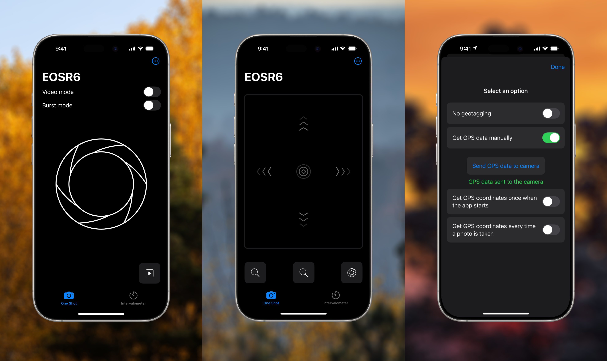

# Remote Lens

This is an iOS app which does not (and will never) require an account and connects to a Canon EOS R series (it may work with other models, likely M series too) cameras, take photos and add GPS tags to photos.

    

## Screenshots

## Features

* Connect to Canon cameras using BLE without creating an account,
* Take a single photo or long press to take many in burst mode,
* Navigate the playback menu from your iPhone, without touching the camera,
* Use the intervalometer for timelapses,
* Add GPS tags in different ways (I don't know how people use this feature so I implemented 4 ways).

## Supported hardware

The following models have been tested:

* EOS R6

From what I read in other projects, the Canon R series and M series all have the same Bluetooth implementation but please let me know by creating an issue if your camera model works or not.

## Credits

* Graphics:
    - [Wi-Fi icon](https://www.svgrepo.com/svg/510343/wifi-high) by zest (MIT License)
    - [Lens icon](https://www.svgrepo.com/svg/79115/lens) by SVG Repo (Public Domain)
* Canon BLE services an characteristics:
    - Thanks to Guo-Rong from [furble](https://github.com/gkoh/furble) for helping me figuring out geotagging.
    - [Canon Bluetooth Control](https://github.com/3bl3gamer/canon-bluetooth-control)
    - [Canon BLE Intervalometer](https://github.com/robot9706/CanonBLEIntervalometer)
    - [Bluetooth SIG Assigned Numbers](https://www.bluetooth.com/wp-content/uploads/Files/Specification/HTML/Assigned_Numbers/out/en/Assigned_Numbers.pdf)

## Appendix

In order to complete or correct what's been documented in [Canon Bluetooth Control](https://github.com/3bl3gamer/canon-bluetooth-control), here's what I found:

* `00030011-0000-1000-0000-d8492fffa821` (`0xf309`) — result of switching modes
    - notifies with `01` before going into suspend

This isn't technically true, the camera notifies with `01` after writing `0x04` to `00030010-0000-1000-0000-d8492fffa821` (`0xf307`). The Canon Camera Connect app happens to write `0x04` before the camera goes to sleep, but the camera doesn't notify `01` by itself before going to sleep.

### GPS Service

UUID: `00040000-0000-1000-0000-D8492FFFA821`

* `00040001-0000-1000-0000-D8492FFFA821` - unknown
    - readable characteristic
* `00040002-0000-1000-0000-D8492FFFA821` - GPS data
    - write `0x01` after being indicated with `0x03` on "Confirm geotagging" characteristic in order to confirm geotagging capabilities
    - write `0x03` disable geotagging
    - write `0x04` + 19 bytes of GPS data
        * byte 0: `0x04`,
        * byte 1: `N` or `S` in ASCII, for North or South,
        * bytes 2-5: Latitude in DD format in float32 little endian,
        * byte 6: `E` or `W` in ASCII, for East or West,
        * bytes 7-10: Longitude in DD format in float32 little endian,
        * byte 11: `+` or `-`in ASCII, for positive or negative,
        * bytes 12-15: Elevation in meters in float32 little endian,
        * bytes 16-19: Unix Timestamp in seconds in int32 little endian.
* `00040003-0000-1000-0000-D8492FFFA821` - Confirm geotagging
    - indicates with `0x01` when GPS receiver has been disabled on camera
    - indicates with `0x02` when GPS receiver has been set on camera
    - indicates with `0x03` after going in the camera menu, when going to GPS receiver > Select GPS device and selecting Smartphone
